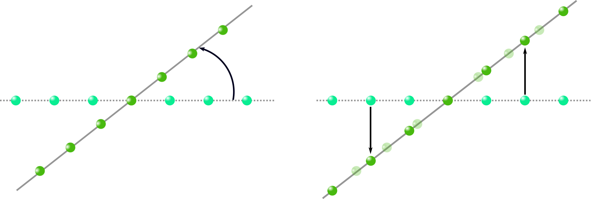
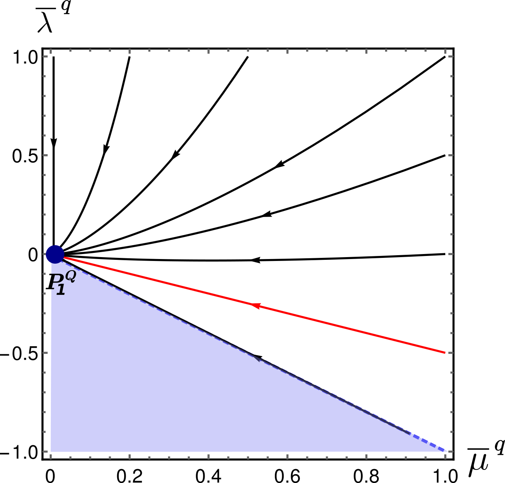
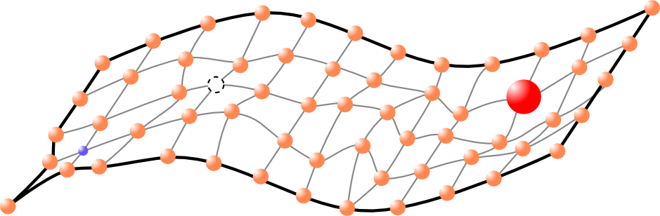
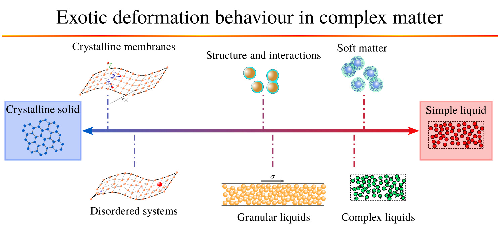

---

title : Research Activities

reading_time: false  # Show estimated reading time?
share: false  # Show social sharing links?
profile: false  # Show author profile?
comments: false  # Show comments?

---



### Elasticity of Cystalline membranes

#### Anomalous Hooke Law

#### Elasticity at low temperatures



#### Effect of frozen disorder on the elasticity

### Internal Structure of Liquids

qeg-envp

### Rheology of granular liquids
